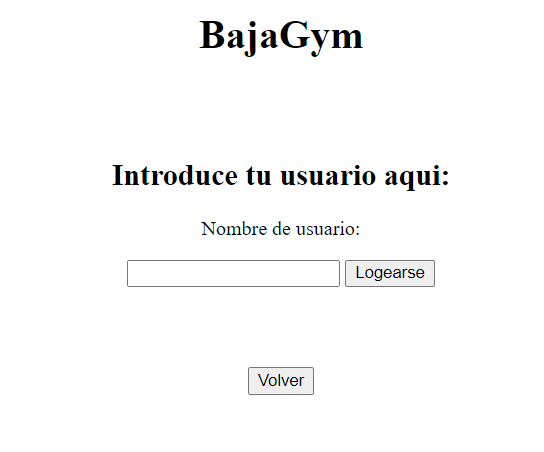
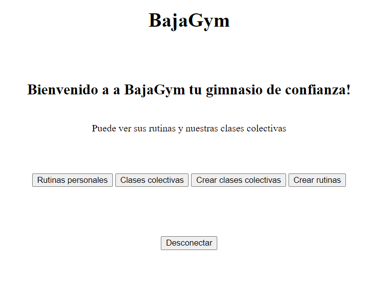
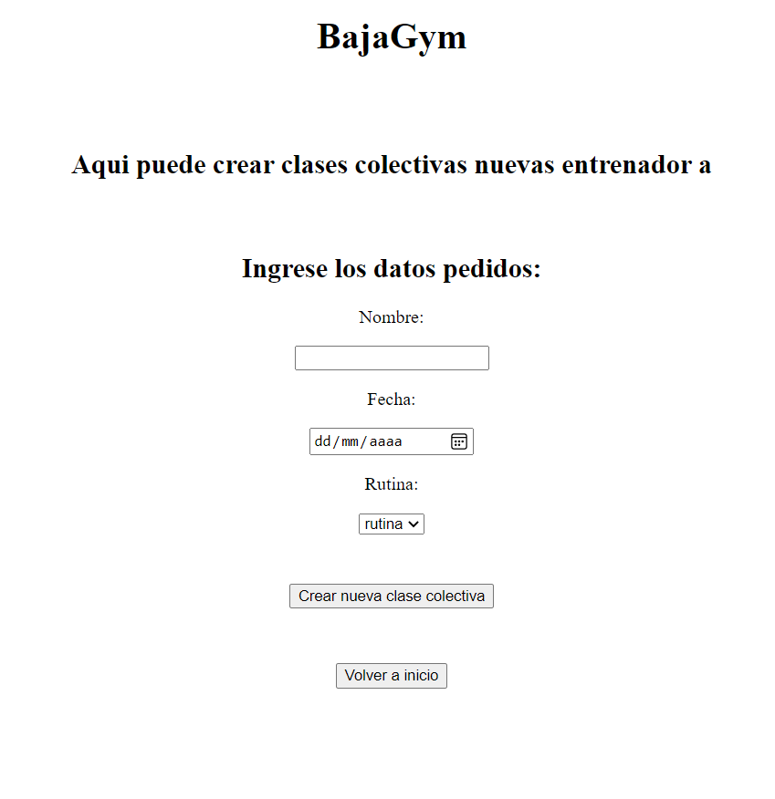
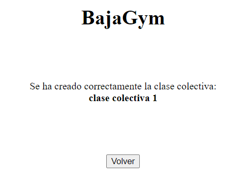
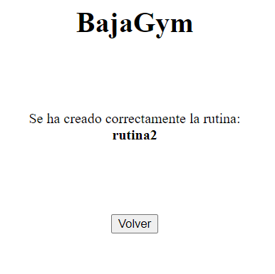

## Nombre de la aplicación web:

BajaGym

## Descripción de la temática de la web, indicando qué funcionalidad es pública y cual es privada y diferente para cada usuario:

La web es la interfaz de la aplicación del gimnasio llamado BajaGym que permite las siguientes cosas:

  - Funcionalidades públicas (usuarios sin registrar):
    1. Loguear.
    2. Consultar rutinas de ejemplo.
    3. Consultar horarios clases colectivas.
    4. Darse de alta.
  - Funcionalidades privadas (usuarios registrados):
    1. Consultar rutina personal.
    2. Apuntarse a clase colectiva.
    3. Pedir cambio rutina.
    4. Crear rutina y modificarla (entrenador).
    5. Crear clase colectiva y modificarlas (entrenador).

## Nombre y descripción de cada una de las 4 o 5 entidades principales:

   - Usuario: persona que usa la aplicación (cliente o entrenador).
   - Rutina: lista de ejercicios a realizar.
   - Ejercicio: movimiento a realizar.
   - Material: objetos que intervienen en los ejercicios.
   - Clases colectivas: rutina realizada por varios usuarios.

## Descripción de las funcionalidades del servicio interno:

  - Enviar notificacion a entrenadores por cambio de rutina.

## Enlace de Trello:

https://trello.com/b/hHIXMNLi/desarrolo-de-aplicaciones-distribuidas

## Diagrama de clases UML

## Diagrama Entidad/relación

## Diagrama de navegación web

## Navegación web

-Login.

-Página principal

-Crear clases colectivas

-Creada clase colectiva

-Crear rutinas

-Creada rutina

-Lista de clases colectivas

-Lista de rutinas ejemplo

